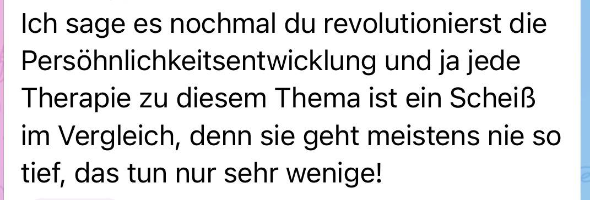
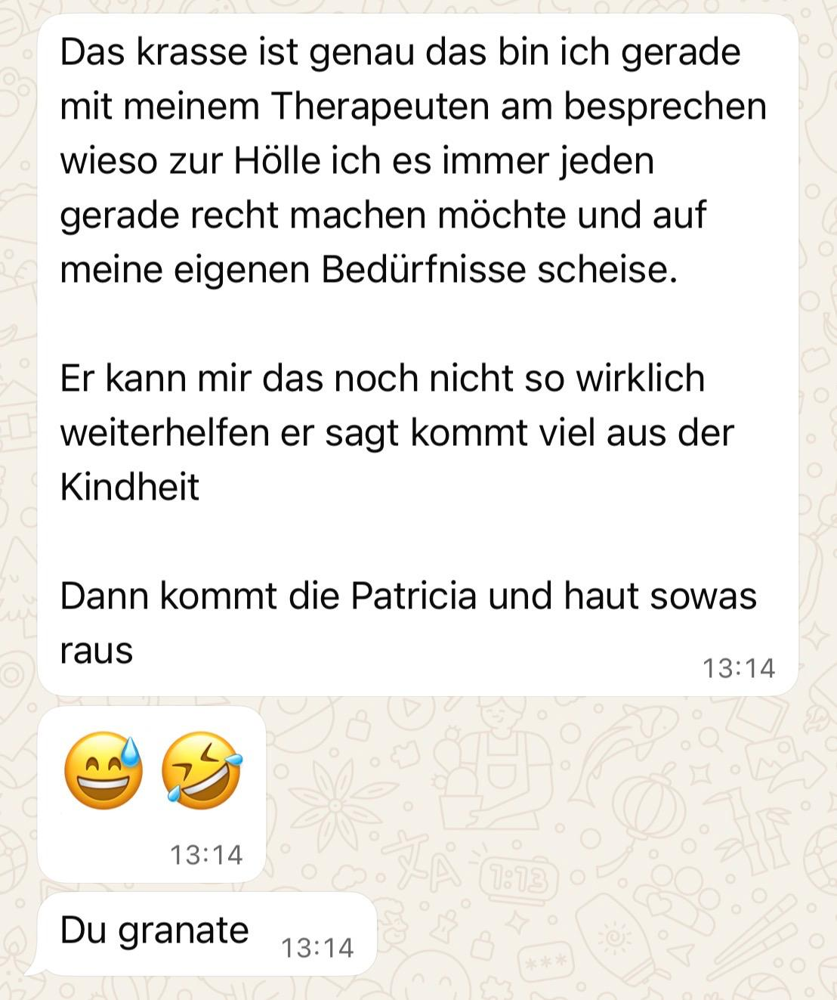
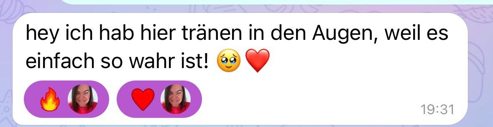
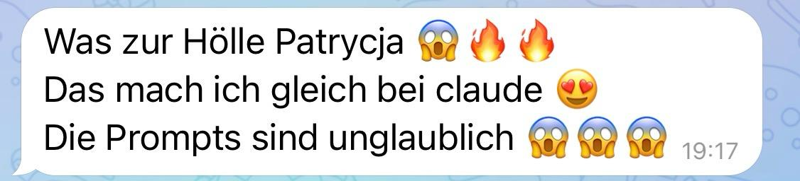
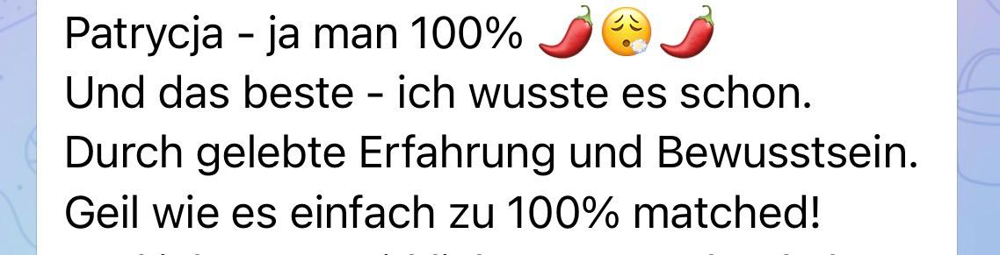
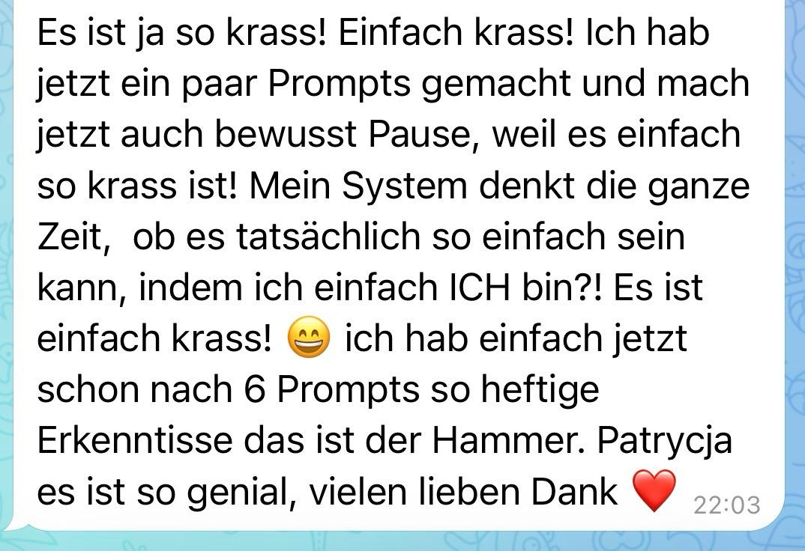
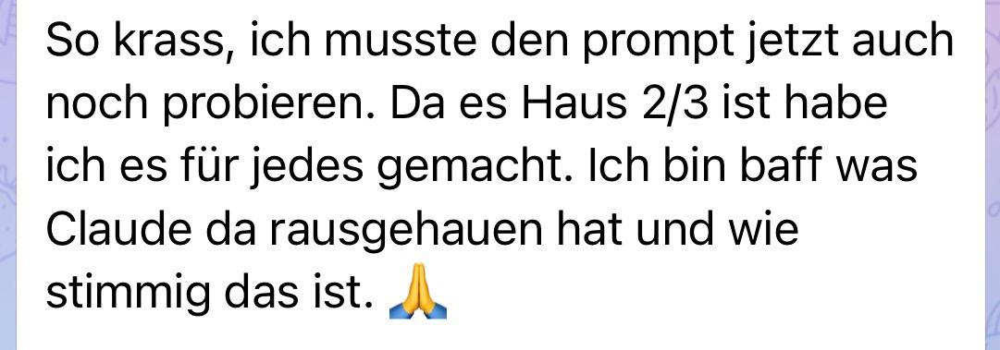
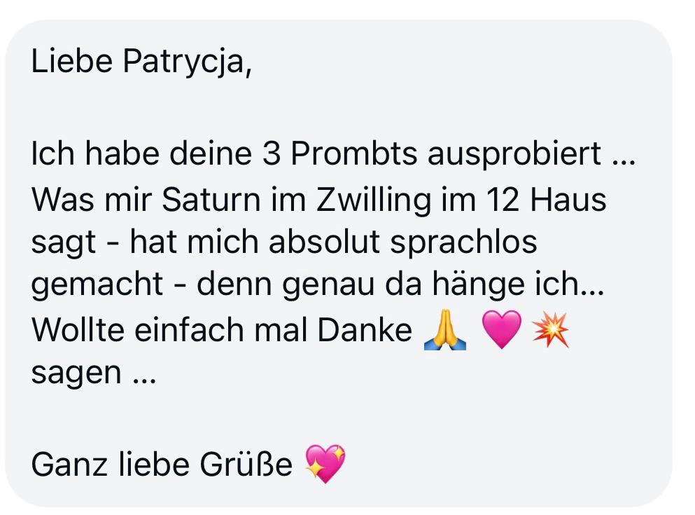
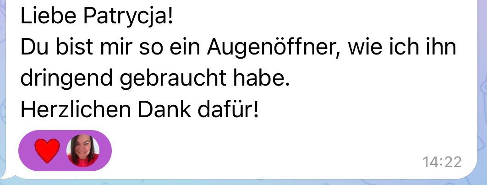
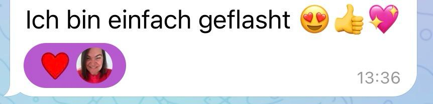

# DeinAstroCode — Salespage (Final)
*Erstellt: 04.06.2026 — auf Patrycjas Original-Voice, mit allen echten Screenshots*

> **Testimonials:** Alle 14 einzigartigen Feedback-Screenshots sind als Bilder eingebaut (`outputs/feedback-astrocode/`). 3 Bilder aus dem Ordner waren exakte Doubletten und sind raus, damit kein Screenshot doppelt auf der Seite klebt.
> **Ein Screenshot ist abgeschnitten** (feedback-02, „Wie krass ist das bitte?"). Schick mir das volle Bild, dann tausche ich es.
> **Design:** Farben/Schrift/Logo kommen rein, sobald du mir dein Branddesign zeigst.

---

## HERO — ganz oben

**DeinAstroCode**

Du weißt, dass da mehr in dir steckt.

Du spürst es. Schon lange.

Dieses Gefühl, noch nicht wirklich angekommen zu sein. Bei dir. In deiner Energie. In dem, wer du wirklich bist.

Du sammelst Wissen. Liest. Hörst. Suchst.

Und trotzdem bleibt diese Lücke.

Weil Wissen nicht transformiert. Verkörperung transformiert.

**[BUTTON: Ich öffne mein Portal → 89€]**

---

## STIMMEN — direkt unter dem Hero, früher Beweis

---

## DER SPIEGEL — das Mechanismus-Stück

Dein Geburtshoroskop ist keine Prophezeiung.

Es ist ein Spiegel. Präzise. Tief. Unbestechlich.

Es zeigt dir, welche Energien dich tragen. Welche Potenziale in dir schlummern, die du noch nicht lebst. Welche Konditionierungen dich steuern, ohne dass du es merkst.

Mit dem richtigen Prompt und der KI als Spiegel bekommst du Antworten, die tiefer gehen als Jahre der Selbstreflexion.

---

## STIMME — eine einzelne, mittig, viel Weißraum

---

## DAS PORTAL — die Auflösung des Angebots

DeinAstroCode ist kein Kurs.

Es ist ein Portal. Du öffnest es. Du gehst durch.

Schicht für Schicht siehst du, wer du wirklich bist. Welche Energie wirklich deine ist. Was du die ganze Zeit schon wusstest, aber noch nicht aussprechen konntest.

In 4 Videos zeige ich dir: Wie du deine Astrochart erstellst. Wie du sie liest. Wie du mit gezielten Prompts und der KI in eine Tiefe gehst, die du alleine kaum erreicht hättest.

Kein Vorwissen. Kein Fachjargon. Nur du, deine Chart und der Mut, wirklich hinzuschauen.

---

## STIMMEN — Block direkt nach dem Portal-Versprechen

---

## DAS ERWARTET DICH — die 4 Module

**Modul 1 — Herzlich Willkommen**
Dein Portal öffnet sich. Du verstehst, worum es hier wirklich geht: nicht um noch mehr Wissen, sondern um die Begegnung mit dir.

**Modul 2 — Dein Geburtshoroskop erstellen**
Einfach, schnell, ohne Registrierung. In wenigen Minuten hast du deine komplette Chart vor dir, mit allen Positionen, mit denen wir arbeiten.

**Modul 3 — Claude und ChatGPT im Vergleich**
Du siehst live, wie die Prompts arbeiten. Welche KI tiefer geht. Wie du aus einer Antwort eine echte Erkenntnis machst.

**Modul 4 — Dein Experiment beginnt jetzt**
Wissen wird Verkörperung. Hier zeige ich dir, wie du das, was du siehst, in deinen Alltag holst. Tag für Tag.

---

## STIMMEN — Block direkt nach den Modulen, wenn die Lust am höchsten ist

---

## FÜR DICH — die Qualifizierung

**Das hier ist für dich, wenn:**

Du spürst, dass da mehr in dir steckt als du gerade lebst.

Du aufgehört hast zu glauben, dass noch ein Kurs die Antwort ist.

Du bereit bist, wirklich hinzuschauen.

**Das hier ist nicht für dich, wenn:**

Du noch ein Zertifikat sammeln willst, um es ins Regal zu stellen.

Du über dich lesen, aber dich nicht bewegen willst.

Du willst, dass jemand anderes die Arbeit für dich macht.

---

## WAS DU BEKOMMST — der konkrete Gegenwert

- 4 Videos, die dich Schritt für Schritt durch deine eigene Chart führen
- Das Prompt Book mit den Prompts, die diese Erkenntnisse auslösen
- Anleitung, wie du deine Chart ohne Registrierung in Minuten erstellst
- Der Planeten Guide für die Positionen, die nicht direkt dabeistehen (IC und Deszendent)
- Lebenslanger Zugang. Du gehst durch dein Portal, wann immer du willst.

**Einführungspreis: 89€**

[FELD ZUM BESTÄTIGEN: Workbook allein oder Bundle Workbook + Kurs für 89€? — sag mir, was rein soll, dann schärfe ich diese Zeile.]

**[BUTTON: Ich öffne mein Portal → 89€]**

Sofort nach deiner Bestellung bekommst du Zugang zu DeinAstroCode und startest dein ganz persönliches Experiment zur Selbstkenntnis. Keine Vorkenntnisse nötig.

---

## STIMMEN — letzter Beweisblock direkt vor dem finalen CTA

---

## WER ICH BIN — kurz, am Ende

Ich beschäftige mich seit 6 Jahren mit Astrologie. Ich erinnere mich genau an den Moment, in dem ich das erste Mal die Codes hinter meiner eigenen Chart gesehen habe. Mir wurde klar, wie viele Konditionierungen in mir stecken. Und wie viele Potenziale ich nicht lebe.

In den letzten 6 Jahren habe ich daraus ein System gebaut, das dir die Arbeit selbst in die Hand gibt. Mit deiner Chart. Mit der KI als Spiegel. Alles, was ich dir hier zeige, ist erprobt. Ich weiß, was dieser Prozess in den Frauen ausgelöst hat, die in den letzten Monaten in meinen Räumen waren.

Ich möchte dir etwas in die Hand geben, mit dem du deine eigene Chart selbst entzifferst.

---

## FINALE — der Abschluss

Die meisten Menschen lesen über sich und suchen immer nach mehr.

Du kannst stattdessen durchgehen.

**Dein Experiment beginnt jetzt.**

**[BUTTON: Ich öffne mein Portal → 89€]**

---

## FAQ — optional, ganz unten

**Brauche ich Vorkenntnisse in Astrologie?**
Nein. Modul 2 zeigt dir, wie du deine Chart in Minuten erstellst. Kein Fachjargon, keine Theorie.

**Brauche ich einen bezahlten KI-Zugang?**
Nein. Es gibt eine kostenlose Version von Claude. Meine klare Empfehlung ist Claude, weil die Antworten tiefer gehen.

**Wie lange habe ich Zugriff?**
Lebenslang. Du gehst durch dein Portal, sooft du willst.

**Was, wenn ich meine Geburtszeit nicht kenne?**
Frag beim Standesamt deines Geburtsortes nach. Die Geburtszeit ist entscheidend für die genaue Chart.

**Ich hab eine Frage, die hier nicht steht.**
Schreib mir: info@patrycja-nasri.de oder auf Instagram.
